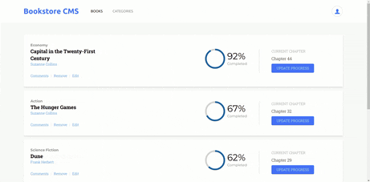

# Bookstore CMS

> **Bookstore CMS** is an SPA made for all the book lovers. It provides an easy way to organize a collection of book, as well as progress tracking functionalities. For instance, a user can easily add a new book by providing a book title and the category.
> It is built using React.js

## Built With

- React (CRA)
- Redux (react-redux)
- TailwindCss

## Milestones

- [x] Milestone 1: **Initialize project with components**
- [x] Milestone 2: **Add reducers and actions**
- [x] Milestone 3: **Use Redux in React components**
- [x] Milestone 4: **Connect to API**
- [x] Milestone 5: **Custom Styling**

## sneak peek

## Getting Started

**Prerequisites:** A Web Browser (preferably FireFox or Chrome)
To get a local copy up and running follow these simple example steps.

### **Option 1**

#### Use the live Website

[BookStore Website](https://samiullahbahadur.github.io/Bookstore/)

### **Option 2**

#### Set up your own copy locally

- Clone [the GitHub Repository](https://github.com/samiullahbahadur/Bookstore)
- Go to the Project `cd Bookstor`
- Run `npm install` to install the _dependencies_
- Run `npm start` to run the live server.

## About me

👤 **Samiullah Bahadur**

## Contributors

Contributions, issues, and feature requests are welcome!

Feel free to check the [issues page](../../issues/).

## Show your support

Give a ⭐️ if you like this project!

## 📝 License

This project is under the [MIT](./LICENSE) license.
